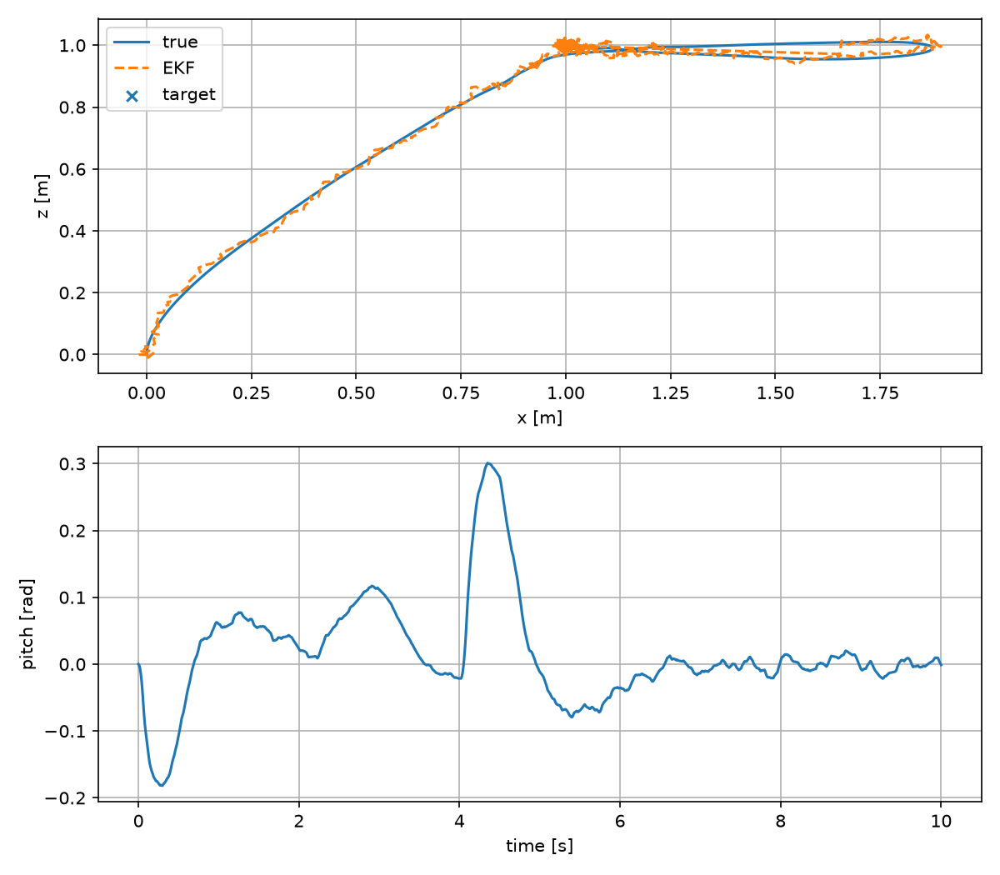

# Quadrotor LQG Fault Tolerance

A from-scratch planar quadrotor simulation that combines nonlinear rigid-body dynamics, a partial-update EKF, and LQG trajectory tracking. Its benchmark makes GPS dropout, bias, and wind gusts first-class reproducible scenarios.



| Scenario | Position RMSE | Final error |
|---|---:|---:|
| Nominal | 0.0074 m | 0.0019 m |
| 1 s GPS dropout | 0.0088 m | 0.0010 m |
| Wind gust | 0.0351 m | 0.0023 m |
| GPS bias | 0.1157 m | 0.1119 m |

## Three-minute run

```bash
python -m venv .venv && source .venv/bin/activate
pip install -e ".[dev]"
python -m quadrotor_lqg.simulate --config configs/nominal.yaml
python -m quadrotor_lqg.benchmark --suite standard
pytest
```

Outputs are written as JSON metrics, CSV time series, and a trajectory figure under `artifacts/`.

## Original contributions

- A nonlinear x-z-pitch plant and analytical hover linearization.
- Joseph-form EKF covariance update with missing measurement channels.
- Repeatable wind, GPS dropout, and GPS bias injection.
- Controller and estimator safety/regression tests rather than visual-only demos.

## Acceptance targets

After the initial transient, nominal position RMSE should remain below 0.20m. A one-second GPS dropout must not cause a crash, and final position error should be below 0.30m. The benchmark generates the measured values.

## Limitations

This two-dimensional model omits yaw, rotor aerodynamics, ground effect, motor lag, and collision geometry. Fault handling is estimator-level resilience, not formal fault-tolerant certification.
